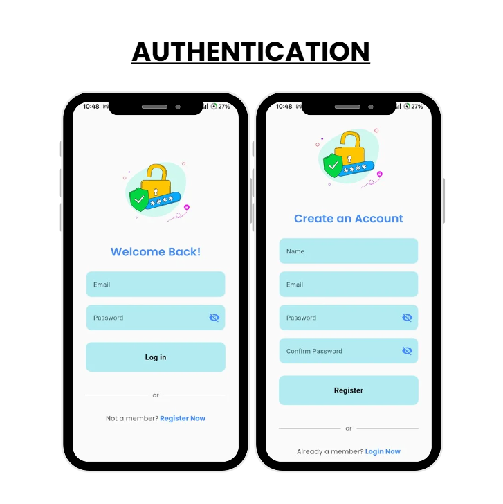
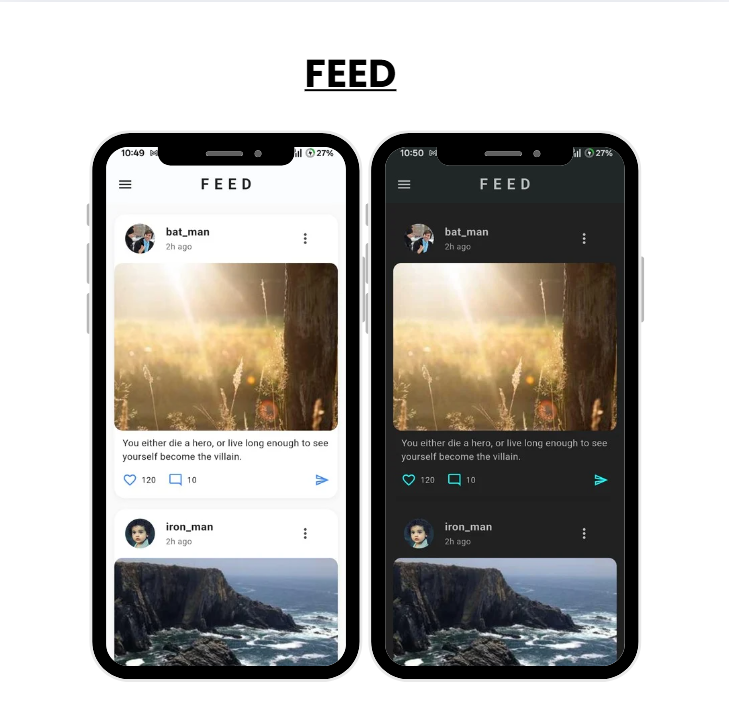
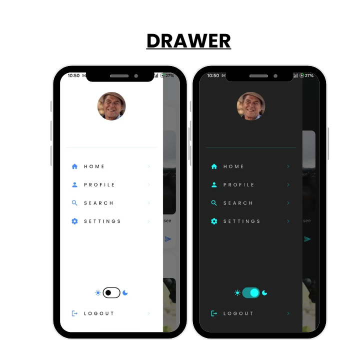
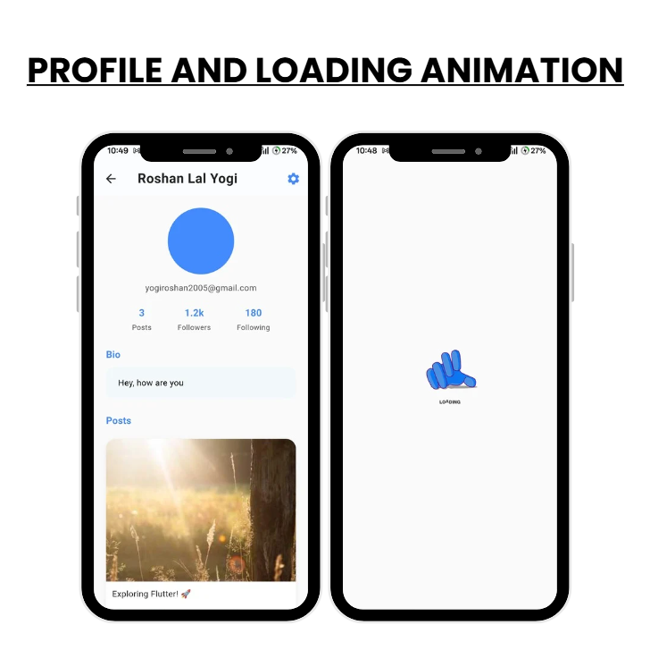

# mil 🌟

A modern, minimal, and fully functional **social media app** built with **Flutter**, **BLoC**, and **Firebase**.  

It uses **Pravatar** and **Picsum** for avatars and post images (to avoid storage costs), **Firebase Auth** for authentication, **Firestore** for database, and **Lottie animations** for smooth loading transitions.

---

## ✨ Features

- 🔑 **Authentication**: Sign up & Login with Firebase Auth  
- 👤 **User Profiles**: Editable profile with Pravatar avatars  
- 🖼 **Posts & Feed**: Create, view, and like posts (Picsum images)  
- 🎛 **BLoC State Management**: Clean and reactive app architecture  
- 🎨 **Animations**: Beautiful Lottie animations for loading & transitions  
- 📶 **Offline Friendly**: Reads cached Firestore data efficiently  

---

## 📱 Screenshots / Demo

---

## 🛠 Tech Stack

| Technology | Description |
|------------|-------------|
| Flutter | Cross-platform mobile framework |
| Firebase Auth | Authentication system |
| Firebase Firestore | NoSQL cloud database |
| BLoC | State management |
| Lottie | Animations |
| Pravatar & Picsum | Avatar & placeholder images |

---

## 🚀 Getting Started

### Prerequisites

- Flutter SDK ([Installation Guide](https://flutter.dev/docs/get-started/install))  
- Firebase project setup

---

## 💡 Notes

- No Firebase Storage used to reduce costs.
- All images are fetched from Pravatar & Picsum APIs.
- BLoC ensures clean and maintainable code.
- Lottie animations enhance user experience.

---

## ❤️ Credits

- Pravatar API - Avatar images
- Picsum API - Placeholder images
- LottieFiles - Animations
